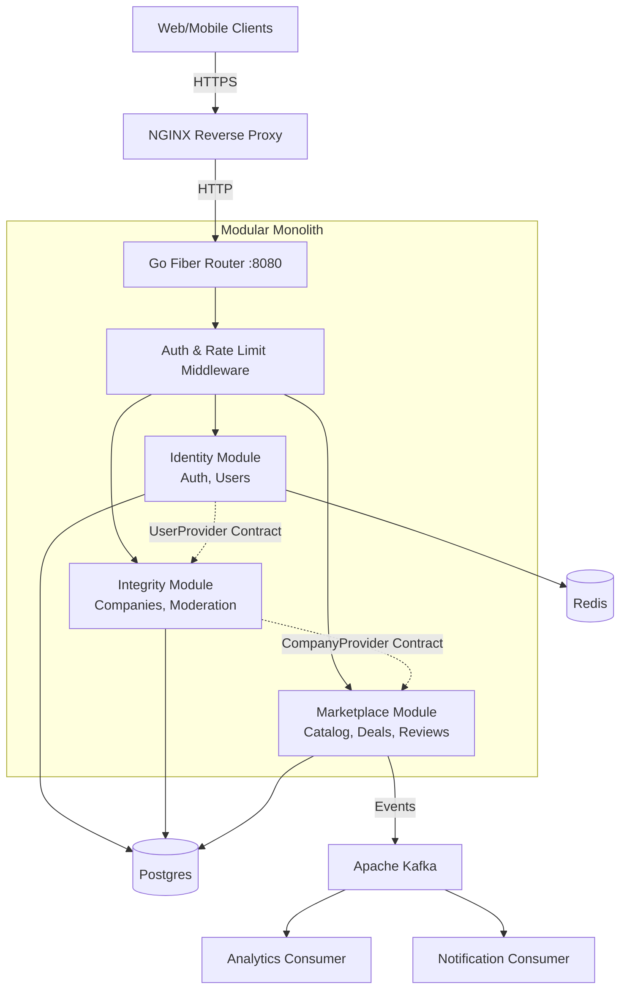

# Industrix — Industrial Equipment Marketplace

A comprehensive digital platform for listing, searching, buying, and renting industrial equipment and related services in the CIS region.

https://nighbee.github.io/industrix/

## Overview

Industrix is a **modular monolith** marketplace platform designed for industrial equipment transactions. The platform serves:

- **Industrial enterprises** seeking to buy or rent equipment
- **Equipment suppliers** listing new and used machinery
- **Service companies** offering delivery, installation, and maintenance
- **Construction, energy, oil & gas, manufacturing SMEs**

### Key Capabilities

- Equipment catalog with advanced search and filtering
- Listing management (sale and rental)
- Real-time messaging between buyers and sellers
- Deal lifecycle management
- Payment processing (Kaspi Pay, Halyk Bank, Uzcard/Humo)
- Document generation and e-signature
- Rating and review system
- Admin moderation panel

---

## Architecture

### Tech Stack

| Layer              | Technology                      |
| ------------------ | ------------------------------- |
| **Frontend**       | React / Next.js · TypeScript    |
| **Backend**        | Go 1.24 · Fiber · Single Binary |
| **Database**       | PostgreSQL 15                   |
| **Cache**          | Redis 7                         |
| **Message Broker** | Apache Kafka                    |
| **Object Storage** | MinIO                           |
| **Search**         | OpenSearch (planned)            |
| **Infrastructure** | Docker / Kubernetes · NGINX     |

### Modular Monolith Flow

The application is structured into strictly bounded contexts (modules) that communicate via defined Go interfaces (Contracts) locally, but publish asynchronous events to Kafka to guarantee loose coupling across the broader domain.



## System Modules Overview

The architecture is divided into the following isolated modules, each responsible for its own domain slice:

1. **Identity Module**: Handles JWT Authentication, OTP verification, and User Profile management.
2. **Integrity Module**: Manages Company onboarding, 12-digit BIN validation, Trust Scores, and the Admin Verification queue.
3. **Core Marketplace (Catalog)**: Equipment CRUD, dynamic attribute schemas (JSON-B), and OpenSearch indexing.
4. **Transactions (Deals)**: Escrow hold/release workflows, Deal State Machines, and Kaspi/Halyk integrations.
5. **Communication**: Real-time Fiber WebSockets chat, Kafka-driven FCM push notifications.
6. **Media**: Gotenberg PDF document generation and MinIO presigned URL image workflows.

---

## Technical Approaches & Best Practices

To ensure a maintainable and scalable codebase, this project strictly adheres to the following principles:

### 1. Contract-Driven Development

Modules never import each other directly. Instead, they depend on defined interfaces (e.g., `UserProvider`, `CompanyProvider`) located in a shared `contracts/` directory. This allows for isolated unit testing and easy extraction into microservices if needed later.

### 2. Explicit Error Handling

Errors are strictly typed using custom Domain Errors (e.g., `ErrNotFound`, `ErrInsufficientFunds`). HTTP handlers map these domain errors to standard HTTP status codes (400, 401, 403, 404, 500) rather than leaking raw database errors to the client.

### 3. Graceful Degradation & Locking

Critical paths utilize robust locking mechanisms:

- **Pessimistic Locking**: `SELECT ... FOR UPDATE` ensures data integrity during financial or deal-state transactions.
- **Distributed Locks**: Redis TTL locks prevent double-booking on rental calendars before confirming the database transaction.

### 4. Fully Documented Planning

Development is driven by a comprehensive 7-phase implementation plan, meticulously documented and tracked via Notion.

- [Architecture Overview (docs/architecture.md)](docs/architecture.md)
- [Implementation Plan (docs/impl-plan.html)](docs/impl-plan.html)
- [Design Specifications (docs/design-plan.html)](docs/design-plan.html)

**Self-hosted:** PostgreSQL, Redis, Kafka, MinIO, Gotenberg, imgproxy, Postal SMTP  
**KZ-compliant:** All data resides on infrastructure in Kazakhstan

---

## Project Structure

```
industrix/
├── backend/                    # Go modular monolith
│   ├── Dockerfile              # single multi-stage build
│   ├── go.mod                  # single module
│   ├── cmd/server/main.go      # entry point
│   ├── contracts/              # cross-module interfaces
│   ├── modules/
│   │   ├── identity/           # auth + profile
│   │   ├── integrity/          # companies + verification
│   │   └── marketplace/        # reviews + reputation
│   ├── platform/middleware/    # auth, ratelimit, logging
│   ├── pkg/                    # shared packages
│   ├── migrations/             # SQL migration files
│   └── docs/                   # swagger generated docs
│
├── frontend/                   # Next.js web application
│
├── infra/                      # infrastructure configs
│   ├── nginx/                  # NGINX + TLS
│   ├── postgres/               # DB init scripts
│   ├── kafka/                  # topic creation
│   └── grafana/                # monitoring dashboards
│
├── docker-compose.yml          # full local stack
├── docker-compose.infra.yml    # infra only
├── docker-compose.override.yml # dev overrides
├── Makefile
└── README.md
```

---

## Getting Started

### Prerequisites

- Docker & Docker Compose
- Go 1.24+ (for local development)
- Node.js 18+ (for frontend development)

### Quick Start

1. **Clone the repository**

2. **Start the full stack**

   ```bash
   docker compose up -d
   ```

3. **Or start infra only + run backend locally**

   ```bash
   docker compose -f docker-compose.infra.yml up -d
   cd backend && go run ./cmd/server
   ```

4. **Access the application**
   - Frontend: http://localhost:3000
   - Backend API: http://localhost:8080
   - Swagger UI: http://localhost:8080/swagger/
   - MinIO Console: http://localhost:9001

### Development Commands

| Command                             | Description           |
| ----------------------------------- | --------------------- |
| `docker compose up -d`              | Start all services    |
| `docker compose down`               | Stop all services     |
| `docker compose logs backend`       | View backend logs     |
| `docker compose build backend`      | Rebuild backend image |
| `cd backend && go run ./cmd/server` | Run backend locally   |
| `cd backend && go test ./...`       | Run tests             |

---

## API Documentation

### Swagger UI

Available at http://localhost:8080/swagger/ when the backend is running.

### Endpoints

| Group         | Method | Path                                   | Auth |
| ------------- | ------ | -------------------------------------- | ---- |
| **Auth**      | POST   | `/api/v1/auth/register`                | No   |
|               | POST   | `/api/v1/auth/login`                   | No   |
|               | POST   | `/api/v1/auth/verify-otp`              | No   |
|               | POST   | `/api/v1/auth/refresh`                 | No   |
| **Users**     | GET    | `/api/v1/users/me`                     | Yes  |
|               | PUT    | `/api/v1/users/me`                     | Yes  |
| **Companies** | POST   | `/api/v1/companies`                    | Yes  |
|               | GET    | `/api/v1/companies/:id`                | Yes  |
|               | PUT    | `/api/v1/companies/:id`                | Yes  |
| **Reviews**   | POST   | `/api/v1/reviews`                      | Yes  |
|               | GET    | `/api/v1/reviews/:entityID`            | Yes  |
|               | GET    | `/api/v1/reviews/:entityID/reputation` | Yes  |
| **Health**    | GET    | `/health`                              | No   |

---

## Monitoring & Observability

- **Metrics**: Prometheus + Grafana dashboards
- **Logging**: Loki with structured JSON logs (zerolog)
- **Tracing**: Jaeger distributed tracing (planned)

Access Grafana at http://localhost:3002 (default: admin/admin)

---

## License

Proprietary — All rights reserved

---

## Contributing

1. Create a feature branch
2. Make changes and add tests
3. Ensure CI passes
4. Submit a pull request
